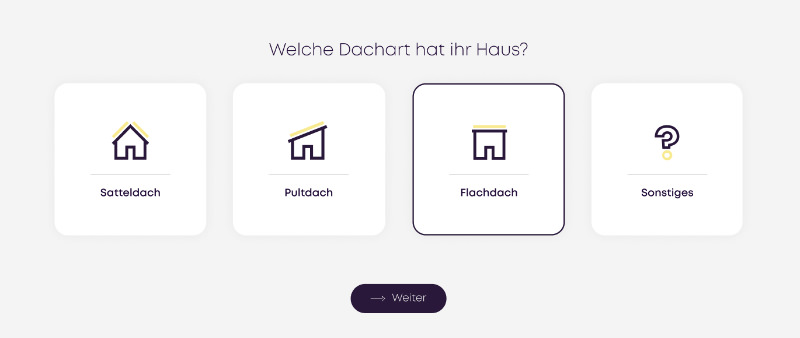

# Contao Icon Checkbox Bundle ✅

**Perfect for Funnels & guided processes!**

The Icon Checkbox makes forms more intuitive. Instead of standard checkboxes, it uses icons for better visual selection – ideal for funnels, filters, and guided processes.  

🚀 Key Benefits:  
✅ Improved Usability: Icons enable faster decision-making  
✅ Seamless Contao Integration: Easy to implement & customize  
✅ Highly Flexible: Use your own SVGs or images  



## Installation

### Install using Contao Manager

Search for **funnel**, **icon**, **field** or **checkbox** and you will find this extension.

### Install using Composer

```bash
composer require plenta/contao-icon-checkbox-bundle
```

## System requirements

- PHP: `^8.0`
- Contao: `^5.3`
- mvo/contao-group-widget `^1.5`

## Thanks to our supporter! ❤️

- [MONOTOMIC](https://monotomic.de)
